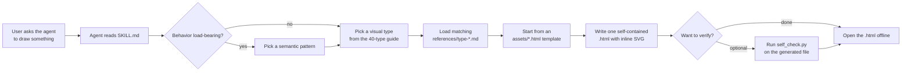

# diagram-design

**An AI-coding-agent skill that turns a request into a single, self-contained, editorial-quality HTML/SVG diagram.**

[](LICENSE)
[](#changelog)
[](#project-structure)

`diagram-design` is not a desktop app or a CLI you run directly. It is a **Skill** — a `SKILL.md` instruction pack plus reference docs, templates, and helper scripts — that you point an AI coding agent at. The agent reads it, picks a visual type, starts from a bundled HTML template, and writes **one `.html` file** with inline SVG and CSS.

The output has **no external CSS, fonts, images, or scripts**. It opens offline in any modern browser, static by default (a small amount of inline JS only when you explicitly ask for animation).

---

## Features

- **Forty visual types** — architecture through database schema, from system diagrams to quantitative charts (see the full list below).
- **One self-contained `.html` per diagram** — inline SVG + inline CSS, zero third-party dependencies, fully offline.
- **Redraw existing sources** — ingest `.drawio` / `.drawio.png` / `.drawio.svg`, Mermaid (`.mmd` or a fenced `mermaid` block), or Excalidraw (`.excalidraw`) and produce a clean redesign, never a pixel conversion.
- **A fixed editorial design system** — opinionated layout, connector, spacing, and typography contracts so diagrams look consistent across agents and sessions.
- **Skin-on-demand theming** — a single token source (`references/style-guide.md`); onboard brand tokens from a website URL, a local design-system folder, or by hand.
- **Semantic patterns, callouts, accessible motion, sketchy/hand-drawn and terminal variants** layered on top of the chosen type.
- **Accessible by default** — every diagram is an accessible SVG figure (`role="img"`, `<title>`/`<desc>`, prefixed IDs).
- **Optional self-check** — `scripts/self_check.py` validates a generated HTML against the accessible-SVG contract, single-file safety, and animation basics.

---

## Why

Diagrams produced ad-hoc by LLMs tend to look like "AI slop": dark backgrounds with glow, identical boxes, labels bleeding through arrows, overlapping connectors, and a different style every run.

This skill removes that variance:

- **Single file, zero deps.** No build step, no CDN, no network at open time — you can drop the output into a docs folder, a slide, or an email.
- **Offline-first.** Fonts and colors come from the local style guide; nothing is fetched at render time.
- **Fixed contracts.** Rounded right-angle connectors, a 4px grid, a complexity budget, and six non-negotiable connector rules are enforced by the reference docs and checklist.
- **Verifiable output.** The optional `self_check.py` script mechanically checks the accessible-SVG contract and that the file stays self-contained.
- **40 types + redraw.** You are not limited to drawing from scratch: an existing draw.io, Mermaid, or Excalidraw file can be extracted and redesigned.

---

## Supported diagram types (40)

This list is kept in lockstep with the **Visual-type guide (40)** in `SKILL.md`. There are exactly **40** types — nothing more.

**Architecture, systems & flow**

Architecture · IT current-state · Flowchart · Sequence · State machine · Swimlane · Loop / flywheel · Nested · Tree · Org chart · Layer stack · Deployment · Dependency graph · Process · Data flow · High-Level data stack

**Data & charts**

ER / data model · Quadrant · Radar / Spider · Polar chart · Venn · Pyramid / funnel · Bar chart · Waterfall · Treemap · Line chart (slopegraph / ridgeline / bump) · Gantt · Scatter plot (bubble / beeswarm) · Medallion layers · Sankey · DP integration · DP security matrix · Database schema

**Software engineering & strategy**

Timeline · Fishbone · Wardley map · Kanban · User journey · UML class · Story map

Each type has its own reference under `references/type-*.md`; pick the type whose layout grammar matches what you are showing, then load that reference before drawing.

---

## How it works



The agent is the renderer. The repo's job is to tell it *what good looks like* and to give it a safe starting point.

---

## Quick Start

**Prerequisite.** Python 3 is only needed to run the two extractors and the optional self-check. The diagram-drawing itself does not need Python — it is the agent following `SKILL.md`.

> On Windows you may need to use `python` instead of `python3` (see [Troubleshooting](#troubleshooting)).

1. Clone the repo:

   ```bash
   git clone <your-fork-or-mirror-url> diagram-design
   cd diagram-design
   ```

2. **Redraw an existing source** (example: a draw.io file). Extract its content summary — extract, don't render — then have your agent redesign it per `SKILL.md`:

   ```bash
   python3 scripts/drawio_extract.py your.diagram
   ```

   The same pattern works for Mermaid and Excalidraw:

   ```bash
   python3 scripts/mermaid_extract.py your.mmd
   python3 scripts/excalidraw_extract.py your.excalidraw
   ```

3. **Optionally self-check a generated diagram.** This validates the accessible-SVG contract, single-file safety, and animation basics:

   ```bash
   python3 scripts/self_check.py assets/example-architecture.html
   ```

   A passing run prints an `OK ...` line. This step is **optional** — it is a safety net, not a build step.

---

## Using with AI coding agents

> Agents load local skills / documents differently. Below is a generic, manual way to wire this skill into any coding agent; check your agent's docs for a "skills", "custom instructions", or "context files" mechanism to automate it.

The universal pattern:

1. Clone this repo into your project (or a shared directory your agent can read).
2. Expose `SKILL.md`, `scripts/`, `assets/`, and `references/` to the agent — e.g. place the repo inside your project, or point your agent's skill/context directory at it.
3. Tell the agent to read `SKILL.md` first whenever a diagram is requested.
4. Allow the agent to run `python3 scripts/*.py` (the extractors and `self_check.py`) as needed.

Concretely, for each agent:

- **Codex / other CLI coding agents** — make the repo part of the working directory or pass it as an instruction/context file, then instruct the agent to load `SKILL.md` before drawing.
- **Claude Code** — drop the repo where your custom skills/context are loaded, or reference `SKILL.md` from your project instructions; grant permission for `python3 scripts/*.py`.
- **Gemini CLI** — add the repo to your context/instructions so `SKILL.md`, `references/`, and `assets/` are visible, and let the agent run the helper scripts.
- **Cursor** — include the repo in your project and reference `SKILL.md` in your rules/context so it is consulted before diagrams are generated.

The exact commands differ per platform and change over time, so do not rely on a one-size-fits-all install flag; the four steps above are the integration contract.

---

## Project structure

```
diagram-design/
├─ SKILL.md            # The skill itself: the instruction pack the agent reads first
├─ Skillicon.png       # Icon for the skill
├─ assets/             # Finished example HTML per type + the three starter templates (162 files)
├─ references/        # Per-type, per-pattern, and spec docs loaded on demand (56 md files)
├─ scripts/           # Four Python helpers: 3 extractors + self_check
└─ examples/          # Short how-to guides (this documentation drop)
```

- `SKILL.md` — the front-of-house contract: philosophy, the 40-type guide, design system, connector rules, checklist.
- `assets/` — layout/composition references only; never inherit their colors or tokens (those live in `references/style-guide.md`). Starter templates: `template.html` (minimal light), `template-dark.html` (minimal dark), `template-full.html` (full editorial).
- `references/` — loaded lazily by type or topic (`type-*.md`, `semantic-patterns.md`, `style-guide.md`, `onboarding.md`, import guides, etc.).
- `scripts/` — `drawio_extract.py`, `mermaid_extract.py`, `excalidraw_extract.py`, `self_check.py`.

---

## Troubleshooting

- **`self_check.py` reports a failure.** Treat it as a contract warning, not a build error. It flags missing `role="img"` / `<title>` / `<desc>`, non-prefixed IDs, external dependencies creeping in, or animation that breaks under reduced-motion. Open the flagged HTML and fix the named contract, then re-run.
- **`python3` is not found on Windows.** Windows Python launchers often expose `python` instead of `python3`. Use `python scripts/drawio_extract.py your.diagram` (and equivalents) on Windows; on macOS/Linux keep `python3`.
- **Diagrams render with missing/wrong fonts offline.** The skill targets local or bundled fonts (Geist / Geist Mono / Instrument Serif). If your system lacks them, the browser falls back to the nearest available family; this is cosmetic, not a functional failure. The skill never fetches fonts from the network.
- **Redraws don't look faithful enough (or look too cluttered).** An import runs a "fidelity ledger": what was merged, collapsed, or dropped. Ask the agent to report it. Set the output dials (format / size / detail / audience) per `references/output-spec.md` before redrawing — `faithful`, `balanced`, or `simplified` detail controls node count.
- **The first diagram in a project asks about the style guide.** That is intentional. A brand onboarding gate pauses if tokens are still the shipped defaults. Either onboard your brand (see `examples/brand-onboarding.md`) or explicitly opt in to the default skin.

---

## License

[MIT](LICENSE) © diagram-design-skill contributors.

---

## Acknowledgements

This project stands on the shoulders of open design systems, icon sets, and diagramming communities. Thanks to the maintainers of **Simple Icons** and the other open icon and type resources that inspired the bundled icon set and typography choices. Thanks to everyone who provided draw.io, Mermaid, and Excalidraw as interchange source formats.
