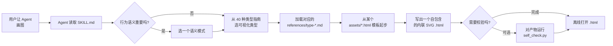

# diagram-design

**一个给 AI 编码 Agent 使用的 Skill，把一句话需求变成单个、自包含、达到编辑级品质的 HTML/SVG 图。**

[](LICENSE)
[](CHANGELOG.md)
[](#项目结构)

`diagram-design` 不是一个可直接运行的桌面 App 或 CLI。它是一个 **Skill** —— 一套 `SKILL.md` 指令文档，外加参考文档、模板和辅助脚本 —— 你把它指给 AI 编码 Agent 即可。Agent 读取它、挑选可视化类型、从内置 HTML 模板起步，然后写出**一个 `.html` 文件**，内联 SVG + CSS。

产物**不含任何外部 CSS、字体、图片或脚本**，可在任何现代浏览器中离线打开；默认静态，只有在你明确要求动画时才引入少量内联 JS。

---

## 特性

- **40 种可视化类型** —— 从架构图到数据库 schema 图，覆盖系统图与定量图表（完整列表见下）。
- **每张图一个自包含 `.html`** —— 内联 SVG + 内联 CSS，零第三方依赖，完全离线。
- **重绘已有源文件** —— 读取 `.drawio` / `.drawio.png` / `.drawio.svg`、Mermaid（`.mmd` 或 fenced `mermaid` 代码块）、Excalidraw（`.excalidraw`），产出干净的重新设计，而不是像素级转换。
- **固定的编辑级设计系统** —— 对版式、连线、间距、字体做出有观点的约束，让不同 Agent、不同会话产出的图风格一致。
- **按需换肤的主题** —— 单一 token 源（`references/style-guide.md`）；可从网站 URL、本地设计系统目录或手动粘贴接入品牌令牌。
- **语义模式、标注、可访问动画、手绘(sketchy)风格与终端风格变体**，叠加在所选类型之上。
- **默认可访问** —— 每张图都是可访问的 SVG 图（`role="img"`、`<title>`/`<desc>`、带前缀的 ID）。
- **可选自检** —— `scripts/self_check.py` 校验生成的 HTML 是否符合可访问 SVG 契约、单文件安全与动画契约。

---

## 为什么需要它

LLM 临时生成的图往往是"AI 味"：深色背景加发光、所有方框一模一样、标签穿过箭头、连线互相重叠、每次风格还不一样。

这个 Skill 消除这种不一致：

- **单文件、零依赖。** 无需构建、无需 CDN、打开时无需联网 —— 可直接放进文档目录、幻灯片或邮件。
- **离线优先。** 字体与颜色来自本地 style guide，渲染时不联网取任何东西。
- **固定契约。** 圆角正交连线、4px 网格、复杂度预算、六条不可妥协的连线规则，都写在参考文档与检查清单里。
- **可校验产物。** 可选的 `self_check.py` 脚本会机械检查可访问 SVG 契约，并确认文件保持自包含。
- **40 种类型 + 重绘。** 不只从零画：已有的 draw.io / Mermaid / Excalidraw 文件可以被提取并重新设计。

---

## 支持的图表类型（40 种）

本列表与 `SKILL.md` 第 3 节 **Visual-type guide (40)** 逐条对齐，**恰好 40 种**，不多列、不夸大。

**架构 / 系统 / 流程类**

Architecture · IT current-state · Flowchart · Sequence · State machine · Swimlane · Loop / flywheel · Nested · Tree · Org chart · Layer stack · Deployment · Dependency graph · Process · Data flow · High-Level data stack

**数据 / 图表类**

ER / data model · Quadrant · Radar / Spider · Polar chart · Venn · Pyramid / funnel · Bar chart · Waterfall · Treemap · Line chart（含 slopegraph / ridgeline / bump） · Gantt · Scatter plot（含 bubble / beeswarm） · Medallion layers · Sankey · DP integration · DP security matrix · Database schema

**软件工程 / 战略类**

Timeline · Fishbone · Wardley map · Kanban · User journey · UML class · Story map

每种类型在 `references/type-*.md` 下都有专属参考文档；先选版式语法匹配你所表达内容的类型，画图前再加载该参考文档。

---

## 工作流程



真正的渲染者是 Agent；本仓库的职责是告诉它"好图长什么样"，并给它一个安全的起点。

---

## 快速开始

**前置条件。** Python 3 仅在运行三个提取器和可选自检脚本时需要。画图本身不需要 Python —— 那是 Agent 照着 `SKILL.md` 做的事。

> 在 Windows 上你可能需要把 `python3` 换成 `python`（见[常见问题](#常见问题)）。

1. 克隆仓库：

   ```bash
   git clone <your-fork-or-mirror-url> diagram-design
   cd diagram-design
   ```

2. **重绘已有源文件**（以 draw.io 为例）。先提取内容摘要 —— 是 extract，不是 render —— 再让 Agent 按 `SKILL.md` 重新设计：

   ```bash
   python3 scripts/drawio_extract.py your.diagram
   ```

   Mermaid 与 Excalidraw 同理：

   ```bash
   python3 scripts/mermaid_extract.py your.mmd
   python3 scripts/excalidraw_extract.py your.excalidraw
   ```

3. **可选地自检一张已生成的图。** 校验可访问 SVG 契约、单文件安全与动画契约：

   ```bash
   python3 scripts/self_check.py assets/example-architecture.html
   ```

   通过时会打印一行 `OK ...`。这一步是**可选的** —— 它是安全网，不是构建步骤。

---

## 与 AI 编码 Agent 一起使用

> 不同平台加载本地 skill / 文档的方式不同。下面是通用的手动接入法；具体请查你所用 Agent 的 "skills"、"custom instructions" 或 "context files" 机制以自动化。

通用模式：

1. 把本仓库 clone 到你的项目里（或放到 Agent 可读的共享目录）。
2. 把 `SKILL.md`、`scripts/`、`assets/`、`references/` 暴露给 Agent —— 例如放进项目，或把 Agent 的 skill/context 目录指到这里。
3. 要求 Agent 在每次画图前先读 `SKILL.md`。
4. 允许 Agent 按需执行 `python3 scripts/*.py`（提取器与 `self_check.py`）。

对各 Agent 的具体做法：

- **Codex / 其它 CLI 编码 Agent** —— 把仓库放进工作目录，或作为指令/上下文文件传入，然后要求 Agent 画图前加载 `SKILL.md`。
- **Claude Code** —— 把仓库放到你加载自定义 skill/context 的位置，或在项目指令里引用 `SKILL.md`；为 `python3 scripts/*.py` 授权。
- **Gemini CLI** —— 把仓库加入上下文/指令，让 `SKILL.md`、`references/`、`assets/` 可见，并允许 Agent 运行辅助脚本。
- **Cursor** —— 把仓库纳入项目，并在规则/上下文中引用 `SKILL.md`，让它在生成图前被查阅。

各平台的具体命令不同且会变化，不要依赖某种万能安装开关；以上四步就是接入契约。

---

## 项目结构

```
diagram-design/
├─ SKILL.md            # Skill 本体：Agent 最先读的指令包
├─ assets/             # 每种类型的成品示例 HTML + 三个起始模板（162 个文件）
├─ references/         # 按类型/主题按需加载的参考文档（56 个 md）
├─ scripts/            # 4 个 Python 辅助脚本：3 个提取器 + self_check
└─ examples/          # 简短上手指南（本文档包）
```

- `SKILL.md` —— 前台契约：设计哲学、40 种类型指南、设计系统、连线规则、检查清单。
- `assets/` —— 仅作版式/构图参考；**不要**继承其中的颜色或 token（token 在 `references/style-guide.md`）。起始模板：`template.html`（minimal light）、`template-dark.html`（minimal dark）、`template-full.html`（full editorial）。
- `references/` —— 按类型或主题懒加载（`type-*.md`、`semantic-patterns.md`、`style-guide.md`、`onboarding.md`、各 import 指南等）。
- `scripts/` —— `drawio_extract.py`、`mermaid_extract.py`、`excalidraw_extract.py`、`self_check.py`。

---

## 常见问题

- **`self_check.py` 报错。** 把它当作契约告警，而不是构建错误。它会标出缺少 `role="img"` / `<title>` / `<desc>`、ID 未加前缀、混入外部依赖、或动画在 reduced-motion 下失效等问题。打开被标记的 HTML，修复对应契约后重跑。
- **Windows 上找不到 `python3`。** Windows 的 Python 启动器常常暴露为 `python` 而非 `python3`。在 Windows 上用 `python scripts/drawio_extract.py your.diagram`（及其它等价命令）；在 macOS/Linux 上继续用 `python3`。
- **离线打开时字体缺失或不对。** 本 Skill 使用本地或内置字体（Geist / Geist Mono / Instrument Serif）。若系统没有这些字体，浏览器会回退到最接近的可用字体；这只是外观问题，不是功能故障。本 Skill 从不联网拉取字体。
- **重绘不够忠实（或太拥挤）。** 导入时会跑一份"fidelity ledger"：记录合并、折叠、丢弃了什么。让 Agent 报告它。在重绘前按 `references/output-spec.md` 设置输出四要素（format / size / detail / audience）—— `faithful`、`balanced`、`simplified` 控制节点数量。
- **项目里第一张图就问你 style guide。** 这是刻意设计：如果 token 还是出厂默认值，品牌接入门禁会暂停。要么接入你的品牌（见 `examples/brand-onboarding.md`），要么明确选择先用默认皮肤。

---

## 许可证

[MIT](LICENSE) © diagram-design-skill contributors。

---

## 致谢

本项目站在开源设计系统、图标集与图示社区的肩膀上。感谢 **Simple Icons** 及其它开源图标与字体资源的维护者，它们启发了内置图标集与字体选择；感谢 draw.io、Mermaid、Excalidraw 作为可互操作的源文件格式。
